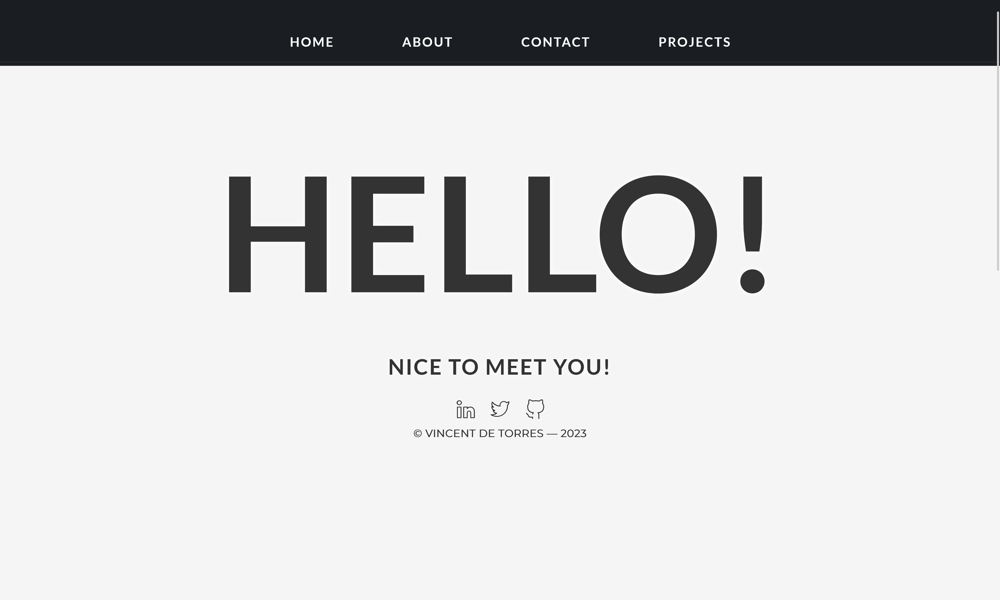
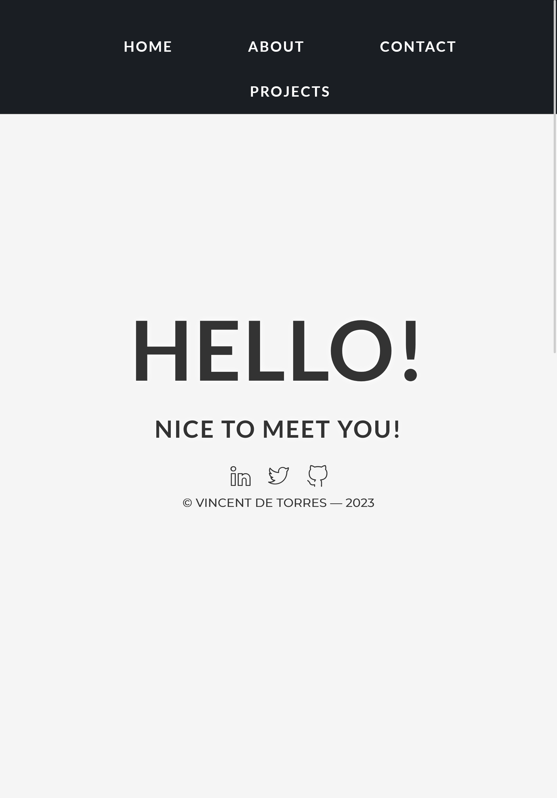
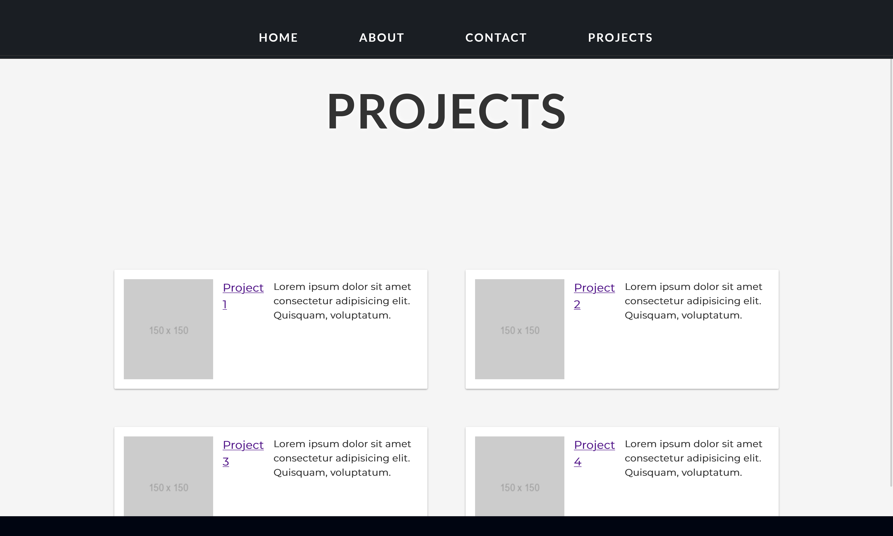
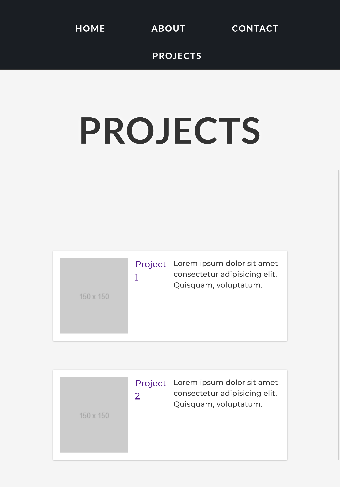
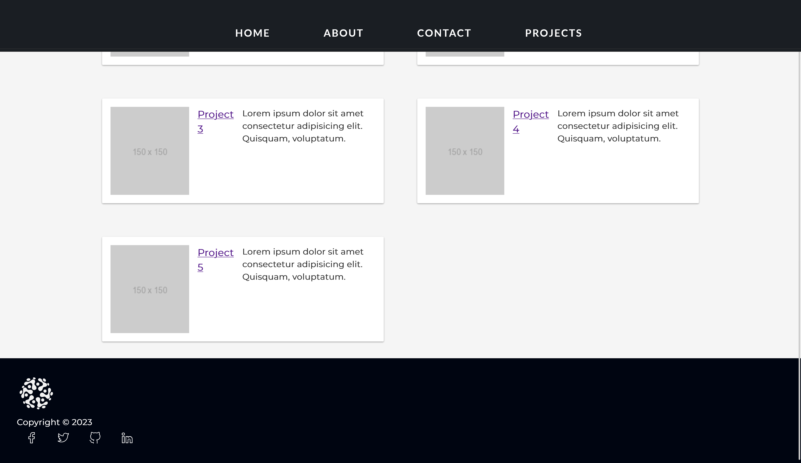
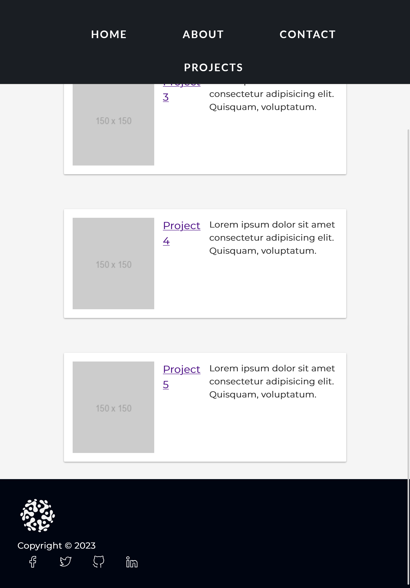

# __personal-portfolio-webpage__

## __OBJECTIVE__

Objective: Build an app that is functionally similar to https://personal-portfolio.freecodecamp.rocks

---

## __PROJECT OUTPUT__

---
<!-- table -->

| Desktop View | Tablet View |
| :---: | :---: |
|  |  |  |
|  |  |  |
|  |  |  |

---

## __PROCEDURE__

User Stories:

- Your portfolio should have a welcome section with an id of welcome-section

- The welcome section should have an h1 element that contains text

-  Your portfolio should have a projects section with an id of projects

- The projects section should contain at least one element with a class of project-tile to hold a project

- The projects section should contain at least one link to a project

- Your portfolio should have a navbar with an id of navbar

- The navbar should contain at least one link that you can click on to navigate to different sections of the page

- Your portfolio should have a link with an id of profile-link, which opens your GitHub or freeCodeCamp profile in a new tab

-  Your portfolio should have at least one media query

- The height of the welcome section should be equal to the height of the viewport

- The navbar should always be at the top of the viewport

Fulfill the user stories and pass all the tests below to complete this project. Give it your own personal style. Happy Coding!

